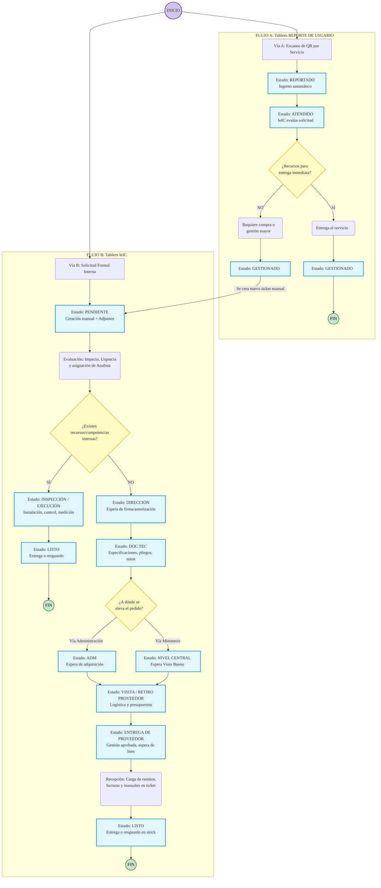

```mermaid
%%{init: {'themeVariables': { 'fontFamily': 'Arial, Helvetica, sans-serif'}}}%%
graph TD
    %% Estilos
    classDef estado fill:#e1f5fe,stroke:#0288d1,stroke-width:2px;
    classDef decision fill:#fff9c4,stroke:#fbc02d,stroke-width:2px;
    classDef fin fill:#c8e6c9,stroke:#388e3c,stroke-width:2px,color:#000;
    classDef inicio fill:#d1c4e9,stroke:#512da8,stroke-width:2px;

    %% INICIO
    Inicio(("INICIO")):::inicio
    Inicio --> VíaA["Vía A: Escaneo de QR por Servicio"]
    Inicio --> VíaB["Vía B: Solicitud Formal Interna"]

    %% FLUJO A
    subgraph FlujoA ["FLUJO A: Tablero REPORTE DE USUARIO"]
        VíaA --> A_Reportado["Estado: REPORTADO<br>Ingreso automático"]:::estado
        A_Reportado --> A_Atendido["Estado: ATENDIDO<br>IeIC evalúa solicitud"]:::estado
        A_Atendido --> DecA{"¿Recursos para<br>entrega inmediata?"}:::decision
        
        DecA -->|"SÍ"| A_EntregaInsumo("Entrega al servicio")
        A_EntregaInsumo --> A_Gestionado1["Estado: GESTIONADO"]:::estado
        A_Gestionado1 --> FinA(("FIN")):::fin
        
        DecA -->|"NO"| A_RequiereCompra("Requiere compra o<br>gestión mayor")
        A_RequiereCompra --> A_Gestionado2["Estado: GESTIONADO"]:::estado
    end

    %% TRANSICIÓN
    A_Gestionado2 -->|"Se crea nuevo ticket manual"| B_Pendiente

    %% FLUJO B
    subgraph FlujoB ["FLUJO B: Tablero IeIC"]
        VíaB --> B_Pendiente["Estado: PENDIENTE<br>Creación manual + Adjuntos"]:::estado
        B_Pendiente --> B_Eval("Evaluación: Impacto, Urgencia<br>y asignación de Analista")
        B_Eval --> DecB{"¿Existen recursos/competencias<br>internas?"}:::decision
        
        %% Gestión Interna
        DecB -->|"SÍ"| B_Inspeccion["Estado: INSPECCIÓN / EJECUCIÓN<br>Instalación, control, medición"]:::estado
        B_Inspeccion --> B_Listo1["Estado: LISTO<br>Entrega o resguardo"]:::estado
        B_Listo1 --> FinB1(("FIN")):::fin
        
        %% Gestión Externa / Compras
        DecB -->|"NO"| B_Direccion["Estado: DIRECCIÓN<br>Espera de firma/autorización"]:::estado
        B_Direccion --> B_DocTec["Estado: DOC TEC<br>Especificaciones, pliegos, notas"]:::estado
        B_DocTec --> DecC{"¿A dónde se<br>eleva el pedido?"}:::decision
        
        DecC -->|"Vía Administración"| B_Adm["Estado: ADM<br>Espera de adquisición"]:::estado
        DecC -->|"Vía Ministerio"| B_Central["Estado: NIVEL CENTRAL<br>Espera Visto Bueno"]:::estado
        
        B_Adm --> B_Visita["Estado: VISITA / RETIRO PROVEEDOR<br>Logística y presupuestos"]:::estado
        B_Central --> B_Visita
        
        B_Visita --> B_Entrega["Estado: ENTREGA DE PROVEEDOR<br>Gestión aprobada, espera de bien"]:::estado
        B_Entrega --> B_Recepcion("Recepción: Carga de remitos,<br>facturas y manuales en ticket")
        B_Recepcion --> B_Listo2["Estado: LISTO<br>Entrega o resguardo en stock"]:::estado
        B_Listo2 --> FinB2(("FIN")):::fin
    end
```
